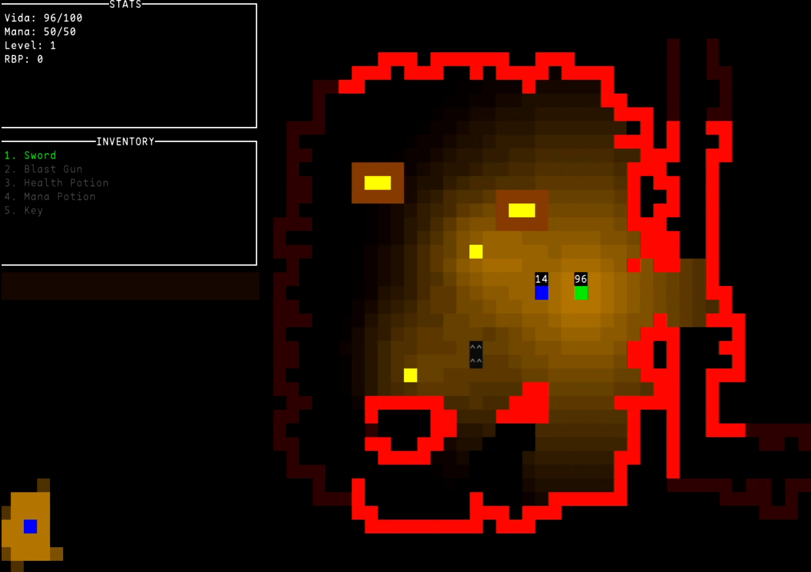

# cave.exp  

**cave.exp** is a roguelite written in C, created for *Laboratórios de Algoritmia 1*. It features procedural cave-like maps, unique mob behaviors, and, unlike other projects, a cool lighting system that brings life to the game world.  

  

## Features  

### 1. **Procedural Cave Maps**  
- Randomly generated caves for every game.  
- Explore a unique layout every time. 
- Every map hides a key to the next level.

### 2. **Dynamic Mobs**  
- Mobs with unique behaviors:  
  - Brave ones chase you head-on.  
  - Cowards run solo but attack in groups.  
  - Clever mobs set traps and call reinforcements.  

### 3. **Lighting System**  
- See only what’s in your line of sight.  
- Environmental lighting

---

## Technologies Used  
- **Language**: C  
- **Libraries**: `ncurses`, `math`  
- **OS**: Linux  

---

## The Journey  
This project wasn’t just about meeting the requirements. The lighting system set it apart, adding depth to the gameplay. Building the game was a fun dive into procedural generation and mob AI.  

---

## How to Run  
1. Clone the repository and extract it.  
2. Run `make` (makefile included).  
3. Execute the game: `./cave.exp`.  

---

## License  
Made for academic purposes. Explore, play, and learn!  
